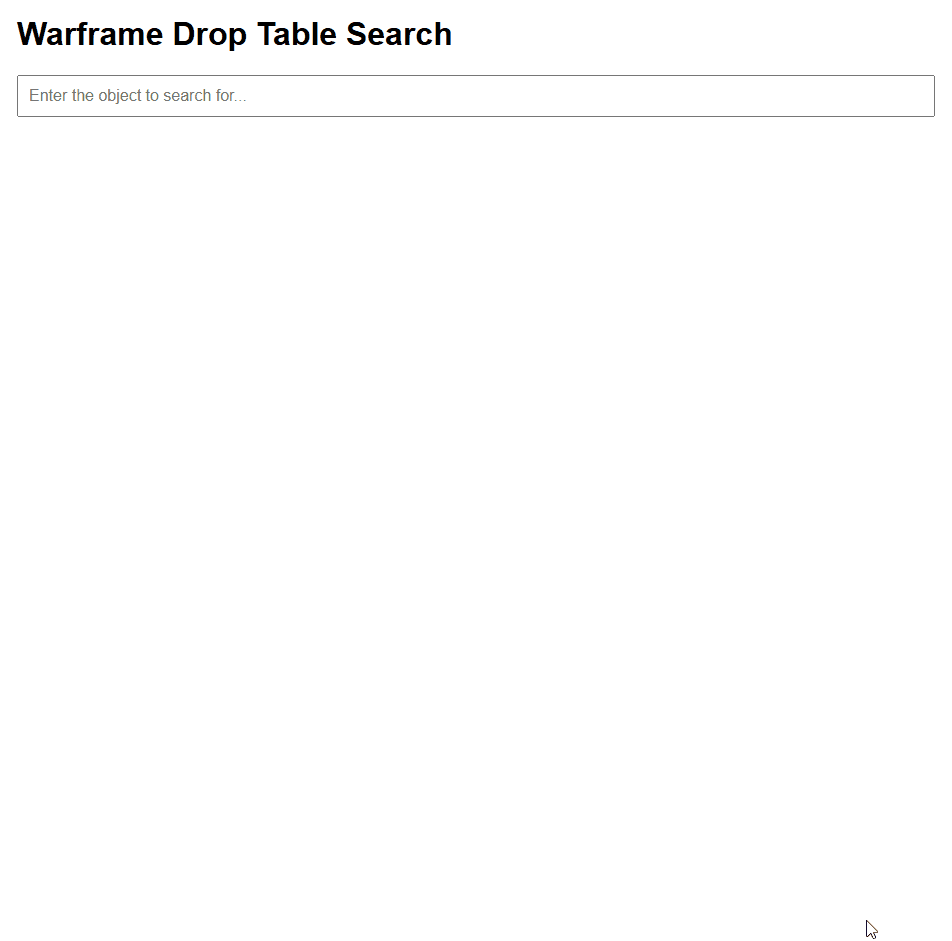

# Warframe Drop Search

https://theoooooo.github.io/warframe-drop-search/

I created this website to be able to search through the drop table that is being exposed through the [Warframe Drop Table Website](https://warframe-web-assets.nyc3.cdn.digitaloceanspaces.com/uploads/cms/hnfvc0o3jnfvc873njb03enrf56.html#phoridassassination)

I was a bit tired to not being able to quickly find drop through mission and drop tables in an efficient wayo i made myself a website drafted from IA in the beginning to gain some timend then modify the content to be able to suit my use

The data.json file contains the datas being loaded inside the websiteo data refresh is configured yetut a daily refresh will be setuped through pipelines.

# Blacklist Categories

There's currently a filter that blacklist certain categories from the drop table website to prevent empty dataset and non-working parsing because some of the tables are formed differentely inside the website :
- "Mod Drops by Source:"
- "Blueprint/Item Drops by Blueprint/Item:"
- "Resource Drops by Source:"

## Implemented Features
- Search Bar working through the following categories :
  - Missions
  - Relics
  - Keys
  - Dynamic Location Rewards
  - Sorties
  - Mod Drops by Mod
  - Blueprint/Item Drops by Blueprint/Item
  - Resource Drops by Resource
  - Cetus Bounty Rewards
  - Orb Vallis Bounty Rewards
  - Cambion Drift Bounty Rewards
  - Zariman Bounty Rewards
  - Albrecht's Laboratories Bounty Rewards
  - Hex Bounty Rewards
  - Sigil Drops by Source
  - Additional Item Drops by Source
  - Relic Drops by Source
- Search Bar filtering results based on the Source (Mission Name / Mob) and the associated Loot (Reward / Mod)
- Visual Color based on Rotation (for missions) and Loot Rarity
- Visual feedback when no results are being found
- Category Selection to refine result view
- Calculation of actual drop chance rate based on the drop rate of the source and the drop chance of your loot within the first drop rate (Actuel Drop Rate)
- Latest Update Time of the dataset is displayed at the top right corner

- You can still display all categories if you click on one category with nothing inside the search bar (be aware of internet browser freezing when doing so, every results has to be displayed)

## Following Features
- Adding average duration for each rotation and mission (manually setut you'll be able to see like "5 minutes for this drop" in average to get)
- Adding more loot categories
- Adding more style to the website